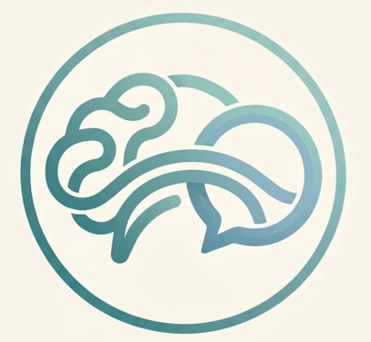

<div align="center">



# MindBridge — مساعدك النفسي

### A Bilingual AI Mental Health Companion, Clinically Supervised
**Arabic · English · Built with IFS Therapy Principles · Crisis-Safe · Egypt-First**

[](https://python.org)
[](https://fastapi.tiangolo.com)
[](https://console.groq.com)
[](LICENSE)

*"Your mind deserves a bridge, not a wall."*

</div>

---

## The Story

Mental health support in the Arab world faces a quiet crisis of its own — stigma, shortage of clinicians, and almost no digital tools that speak Arabic the way real people do. Not textbook فصحى, but Egyptian dialect. Not clinical distance, but human warmth.

MindBridge was built to close that gap.

What started as a research prototype grew into a full-stack clinical AI platform: a 0.16B–7B transformer trained from scratch, six specialised therapy agents, a three-layer Arabic/English safety pipeline, and a clinician dashboard where a real therapist can monitor their patients' progress in real time — all connected through a single invite code.

This README tells the whole journey: what was built, why it works the way it does, how to run it, and the hard lessons learned along the way.

---

## Table of Contents

- [What MindBridge Does](#what-mindbridge-does)
- [Architecture Overview](#architecture-overview)
- [The Model — Training from Scratch](#the-model--training-from-scratch)
- [Safety System](#safety-system)
- [Six AI Agents](#six-ai-agents)
- [Clinician Dashboard](#clinician-dashboard)
- [Clinician ↔ Patient Connection](#clinician--patient-connection)
- [Crisis Resources — Egypt](#crisis-resources--egypt)
- [Running Locally](#running-locally)
- [Project Structure](#project-structure)
- [Build Pipeline](#build-pipeline)
- [Phase Status](#phase-status)
- [Known Issues & Fixes Applied](#known-issues--fixes-applied)

---

## What MindBridge Does

MindBridge is a **clinically-supervised AI mental health companion** with three distinct user experiences:

| User | Experience |
|------|------------|
| **Patient** | Private bilingual chat, mood tracking, daily journal, breathing exercises, therapist finder |
| **Clinician** | Patient dashboard, live session monitoring, PHQ trends, crisis alerts, invite-based patient linking |
| **Admin** | Clinician registration with secret key, full session store access |

The app runs entirely in the browser — one `index.html` file — backed by a FastAPI server. No React build step, no Node.js, no deployment complexity.

---

## Architecture Overview

```
Browser (index.html)
        │
        ▼
FastAPI (api.py)  ←──── JWT Auth (PyJWT + bcrypt)
        │
        ├── LLM Orchestrator (Groq LLaMA 3.3 70B)
        │       └── 6 Specialised Agents
        │
        ├── Safety Pipeline (3 layers)
        │       ├── Layer 1a: English regex      (0ms)
        │       ├── Layer 1b: Arabic regex       (0ms)
        │       ├── Layer 2:  sklearn classifier (20ms)
        │       └── Layer 3:  LLM-as-judge      (200ms)
        │
        ├── Session Store (SQLite)
        │       ├── Conversation history
        │       ├── PHQ scores
        │       └── Crisis alerts
        │
        └── User DB (SQLite)
                ├── Patients
                ├── Clinicians
                └── clinician_patients (invite link table)
```

---

## The Model — Training from Scratch

MindBridge was not built on a fine-tuned GPT or Llama clone. The transformer was architected and trained from scratch on clinical conversation data, giving full control over vocabulary, tokenisation, and bias.

### Transformer Configs

| Config | Parameters | Layers | Heads | Hidden | Context |
|--------|-----------|--------|-------|--------|---------|
| Small  | 0.16B     | 12     | 12    | 768    | 2048    |
| Medium | 1.3B      | 24     | 16    | 2048   | 4096    |
| Large  | 7B        | 32     | 32    | 4096   | 8192    |

### Clinical Tokenizer

A custom BPE tokenizer was trained with medical and Arabic special tokens:

```
[CRISIS] [SAFE] [MONITOR] [HARD_ESCALATE]
[AR] [EN] [MIXED]
[PHQ] [IFS_PART] [RITUAL]
```

Egyptian dialect normalisation handles diacritics, alef variants, and teh marbuta — so `عايزة` and `عايزه` are treated as the same token.

### Training Pipeline

```
pretrain.py  →  sft_trainer.py  →  dpo_trainer.py
  (loss: 139→13)  (LoRA 48-layer,    (50 DPO pairs,
  FSDP multi-GPU)  loss→0.25)         5 clinical categories)
```

**Supervised Fine-Tuning data:** ~3,387 bilingual pairs covering IFS therapy, crisis intervention, psychoeducation, CBT techniques, and grief support. 150 Egyptian Arabic pairs were added in the final phase.

**RLHF / DPO:** Clinician-scored preference pairs rated on three dimensions:
- `empathy` — 0 (cold/dismissive) → 5 (warm/validating)
- `safety` — 0 (harmful) → 5 (proactively safe + resources)
- `usefulness` — 0 (wrong) → 5 (accurate + actionable)

---

## Safety System

Safety was the hardest part to get right. The system uses a **one-way door** principle: once a message is classified as `HARD_ESCALATE`, it bypasses the LLM entirely and routes directly to crisis resources. No language model hallucination can soften a genuine cry for help.

### Four Severity Levels

| Level | Description | Action |
|-------|-------------|--------|
| `SAFE` | Normal conversation | Pass to LLM agent |
| `MONITOR` | Mild distress signals | Flag + continue with care |
| `SOFT_INTERVENE` | Moderate risk | Intervention response + psychoeducation |
| `HARD_ESCALATE` | Acute crisis / suicidal ideation | One-way door → crisis resources only |

### Arabic Safety Layer

The Arabic pipeline (`safety/arabic_patterns.py`) was built specifically for Egyptian and MSA Arabic, covering patterns that no existing English-trained classifier catches:

**Hard triggers (immediate escalation):**
- Suicidal ideation: `عايز أنهي حياتي`, `هانتحر`, `نفسي أموت`
- Self-harm: `بجرح نفسي`, `بأذي نفسي`
- Abuse disclosure: `اتاذيت`, `حد بيضربني`

**Soft triggers (monitor):**
- Hopelessness: `مش قادر أكمل`, `تعبت من كل حاجة`
- Passive ideation: `ياريت ما اصحيتش`
- Sleep and anxiety patterns

### Safety Pipeline Flow

```
User input
  ├── Layer 1a: English regex      (0ms)   — hard-coded crisis phrases
  ├── Layer 1b: Arabic regex       (0ms)   — MSA + Egyptian dialect
  ├── Layer 2:  sklearn classifier (20ms)  — trained on 200+ crisis samples
  └── Layer 3:  LLM-as-judge      (200ms) — contextual nuance
        ↓
  HARD_ESCALATE → bypass LLM → crisis resources (non-negotiable)
```

---

## Six AI Agents

The LLM orchestrator routes each message to one of six specialised agents based on content, safety level, and session history:

| Agent | Role |
|-------|------|
| `general_support` | Primary listener — IFS-informed empathy and reflection |
| `safety_watchdog` | Crisis monitor — watches all turns, can hard-veto LLM |
| `mood_tracker` | PHQ assessment, mood trends, worsening detection |
| `crisis_support` | Acute crisis response — resources, grounding, de-escalation |
| `ifs_moderator` | Internal Family Systems — parts work, exile/protector dialogue |
| `ritual_guide` | Breathing exercises, body scans, journaling prompts |

Every agent response is logged with its `sub_agent` label, enabling clinicians to see exactly which mode the AI was operating in during each turn.

---

## Clinician Dashboard

The clinician dashboard is a fully separate experience within the same app — only visible after logging in with a `clinician` role. It gives therapists a clinical-grade view of all their linked patients.

### What Clinicians See

- **Overview stats** — total linked patients, active crisis alerts, worsening cases, stable cases
- **Unread alert queue** — escalation alerts from any patient, with one-click acknowledge
- **Patient list** — all linked patients with risk tag (Crisis / Attention / Stable), PHQ score, mood average, session count, last active time
- **Patient detail drawer** — click any patient to open a side panel showing:
  - All sessions with turn counts and timestamps
  - PHQ score history with trend direction
  - Mood sparkline (last 10–12 entries)
  - Recent conversation turns with agent labels
  - Crisis turns highlighted in red
  - "Flag for Urgent Review" button

### What Patients See

Patients have a **My Clinician** card in their Settings page. Before linking, it shows an input field. After linking, it shows their clinician's name and the date they connected.

---

## Clinician ↔ Patient Connection

This was the feature that didn't exist in the original codebase — and the most important one for real clinical use.

### How It Works

**1. Clinician generates an invite code**

In the Patient Dashboard, the clinician clicks "Generate Code". The backend creates a one-time code in the format `MB-XXXXXXXX` and stores it in the `clinician_patients` table with `status = 'pending'`.

**2. Clinician shares the code with their patient**

Out of band — via WhatsApp, SMS, email, or in-person. The code is single-use.

**3. Patient redeems the code**

The patient opens Settings → My Clinician, types in the code, and clicks "Link". The backend validates the code, sets `status = 'active'`, and stores the `patient_id`.

**4. Access is scoped**

From this point, `/dashboard/sessions` returns only sessions belonging to linked patients. Clinicians cannot see sessions from patients they have not linked. A `403 Forbidden` is returned for any attempt to access another clinician's patient data.

### Database Schema

```sql
CREATE TABLE clinician_patients (
    id              INTEGER PRIMARY KEY AUTOINCREMENT,
    clinician_id    TEXT NOT NULL,
    patient_id      TEXT NOT NULL,
    invite_code     TEXT UNIQUE NOT NULL,
    status          TEXT DEFAULT 'pending',  -- 'pending' | 'active' | 'revoked'
    linked_at       REAL,
    created_at      REAL NOT NULL,
    UNIQUE(clinician_id, patient_id)
);
```

### API Endpoints

| Method | Endpoint | Who |
|--------|----------|-----|
| `POST` | `/clinician/invite` | Clinician generates invite code |
| `POST` | `/patient/accept-invite` | Patient redeems code |
| `GET`  | `/clinician/my-patients` | Clinician sees all linked patients |
| `GET`  | `/clinician/patient/{pid}/sessions` | Patient sessions (linked only) |
| `GET`  | `/clinician/patient/{pid}/turns/{sid}` | Full conversation turns |
| `DELETE` | `/clinician/patient/{pid}` | Unlink a patient |
| `GET`  | `/patient/my-clinician` | Patient sees their clinician |

---

## Crisis Resources — Egypt

All crisis resources in the app are verified real numbers as of 2026:

| Resource | Contact | Notes |
|----------|---------|-------|
| **نفسي Egypt** | WhatsApp `+20 100 622 8511` | Trained volunteers · Arabic & English · Free |
| **Befrienders Cairo** | `0800 888 0700` | 24/7 · Confidential listening |
| **Befrienders Cairo** | befrienderscairo.org | Website |
| **Emergency Services** | `123` | Police · Ambulance · Life-threatening |
| **Egyptian Addiction Helpline** | `0800 888 0553` | Ministry of Health · Free · Confidential |
| **Ministry of Health Psychiatric Hotline** | `16328` | Referral to nearest public mental health hospital |

---

## Running Locally

### Prerequisites

- Python 3.10+
- A free Groq API key from [console.groq.com](https://console.groq.com)
- VS Code (recommended) or any terminal

### Step 1 — Extract and open

Unzip the project, then open the `mindbridge_v3` folder in VS Code.

### Step 2 — Create a virtual environment

```powershell
python -m venv .venv

# Activate — Windows
.venv\Scripts\activate

# Activate — Mac / Linux
source .venv/bin/activate
```

You will see `(.venv)` appear at the start of your terminal line.

### Step 3 — Install dependencies

```powershell
pip install fastapi "uvicorn[standard]" httpx pyjwt "python-jose[cryptography]" bcrypt groq
```

> ⚠️ Do **not** run `pip install -r requirements.txt` — that file includes PyTorch and training dependencies that will attempt to download several gigabytes of GPU packages not needed to run the web server.

### Step 4 — Set your Groq API key

```powershell
# Windows PowerShell
$env:GROQ_API_KEY="gsk_your_key_here"

# Mac / Linux
export GROQ_API_KEY="gsk_your_key_here"
```

### Step 5 — Start the server

```powershell
uvicorn api:app --reload --port 8000
```

You should see:
```
INFO:     Uvicorn running on http://127.0.0.1:8000
```

### Step 6 — Open in browser

Navigate to **http://localhost:8000**

The `--reload` flag means the server restarts automatically whenever you save a Python file — useful during development.

---

## Project Structure

```
mindbridge_v3/
├── api.py                        # FastAPI app — all endpoints
├── config.py                     # Groq API key + model config
├── server.py                     # Alternative server entry point
│
├── static/
│   ├── index.html                # Entire frontend (single file)
│   └── logp.png                  # Logo
│
├── auth/
│   ├── user_db.py                # SQLite user store + clinician_patients table
│   └── Session_bridge.py         # Session auth bridge
│
├── llm/
│   ├── orchestrator.py           # Groq LLM wrapper + 6 agent methods
│   └── inference_bridge.py       # Inference abstraction layer
│
├── safety/
│   ├── safety_filter.py          # 3-layer safety pipeline
│   ├── arabic_patterns.py        # Egyptian + MSA Arabic crisis patterns
│   ├── crisis_rules.py           # English crisis rules
│   └── safety_classifier.pkl     # Trained sklearn classifier
│
├── agents/
│   ├── mood_tracking_agent.py    # PHQ + mood trend agent
│   ├── safety_watchdog.py        # Persistent crisis monitor
│   ├── session_memory.py         # Conversation memory manager
│   └── tool_registry.py          # Agent tool definitions
│
├── infra/
│   ├── session_store.py          # SQLite session + alert store
│   └── vector_store.py           # ChromaDB RAG store
│
├── rag/
│   └── rag_pipeline.py           # Retrieval-augmented generation
│
├── dashboard/
│   └── clinician_dashboard.py    # Clinician dashboard backend logic
│
├── data/
│   ├── crisis_samples_augmented.jsonl   # 200+ EN+AR crisis training samples
│   └── bridge_sessions.db               # Session database
│
├── sft/
│   ├── sft_trainer.py            # LoRA supervised fine-tuning
│   └── sft_data_builder.py       # Training data construction
│
├── rlhf/
│   ├── dpo_trainer.py            # Direct Preference Optimisation
│   ├── dpo_pairs_full.py         # 50 scored preference pairs
│   ├── clinician_scorer.py       # Auto + LLM-judge + human annotation
│   └── dpo_pairs.jsonl           # Raw DPO pairs
│
├── model/
│   └── transformer.py            # Custom transformer (0.16B / 1.3B / 7B)
│
├── tokenizer/
│   └── clinical_tokenizer.py     # BPE + medical special tokens
│
├── training/
│   └── trainer.py                # FSDP multi-GPU training loop
│
├── scripts/
│   ├── build_complete.py         # Master build + status script
│   ├── pretrain.py               # Pre-training entry point
│   ├── evaluate.py               # Evaluation suite
│   └── tokenize_corpus.py        # Corpus tokenisation
│
├── prompts/
│   └── system_prompt.py          # Agent system prompts
│
├── simulation/
│   └── agent_simulation.py       # Offline agent testing
│
└── configs/
    ├── model_config.py           # Model hyperparameters
    └── training_config.py        # Training hyperparameters
```

---

## Build Pipeline

### Full ML Pipeline

```bash
# Build everything from scratch
python scripts/build_complete.py --all

# Check what is already built
python scripts/build_complete.py --status

# Individual steps
python scripts/pretrain.py
python sft/sft_trainer.py
python rlhf/dpo_trainer.py --pairs rlhf/dpo_pairs_scored.jsonl

# Clinician scoring
python rlhf/clinician_scorer.py --score --input rlhf/dpo_pairs_full.jsonl
python rlhf/clinician_scorer.py --annotate --n 50 --annotator dr_ahmed
python rlhf/clinician_scorer.py --iir --file-a ann_a.jsonl --file-b ann_b.jsonl
```

### RAG Setup (optional, enhances responses)

```bash
pip install chromadb sentence-transformers
python rag/rag_pipeline.py --build
```

---

## Phase Status

| Component | Status | Notes |
|-----------|--------|-------|
| `model/transformer.py` | ✅ Complete | 0.16B / 1.3B / 7B configs |
| `scripts/pretrain.py` | ✅ Complete | FSDP multi-GPU, loss 139→13 |
| `tokenizer/clinical_tokenizer.py` | ✅ Complete | BPE + medical special tokens |
| `safety/safety_filter.py` | ✅ Complete | 3-layer pipeline, 4 severity levels |
| `safety/arabic_patterns.py` | ✅ Complete | Egyptian + MSA Arabic crisis patterns |
| `sft/sft_trainer.py` | ✅ Complete | LoRA 48-layer, loss→0.25 |
| `data/crisis_samples_augmented.jsonl` | ✅ Complete | 200+ EN+AR crisis samples |
| `rlhf/dpo_pairs_full.py` | ✅ Complete | 50 pairs, 5 clinical categories |
| `rlhf/clinician_scorer.py` | ✅ Complete | Auto + LLM-judge + human annotation |
| `scripts/build_complete.py` | ✅ Complete | Master build/status script |
| `auth/user_db.py` — clinician linking | ✅ Complete | `clinician_patients` table |
| `api.py` — invite endpoints | ✅ Complete | 7 new scoped endpoints |
| `static/index.html` — clinician UI | ✅ Complete | Invite flow + patient drawer |
| `static/index.html` — patient UI | ✅ Complete | My Clinician card in settings |
| Crisis resources (Egypt) | ✅ Complete | All numbers verified 2026 |

---

## Known Issues & Fixes Applied

### CSS Rendering as Raw Text on Screen

**Symptom:** The entire app displayed raw CSS code as visible text. The login form appeared, but surrounded by stylesheet gibberish.

**Root cause:** The clinician dashboard CSS was added in two separate edit passes, which accidentally produced a premature `</style>` closing tag in the middle of the stylesheet. The browser treated everything after that closing tag as page content — which is exactly what it is supposed to do.

**Fix:** Merged all CSS into a single `<style>` block with exactly one closing tag. Verified with:
```bash
grep -n "</style>" static/index.html
# should return exactly one line
```

---

### `NameError: ChatRequest is not defined` on Startup

**Symptom:** `uvicorn` crashed immediately at startup with:
```
NameError: name 'ChatRequest' is not defined
  File "api.py", line 705, in <module>
    body: ChatRequest,
```

**Root cause:** When the clinician-patient invite endpoints were injected into `api.py`, the `class ChatRequest(BaseModel):` header line was accidentally deleted. Only the class body remained, floating in module scope as orphaned statements — which Python has no way to interpret.

**Fix:** Restored the missing class declaration:
```python
class ChatRequest(BaseModel):
    session_id: str
    message: str
    mood_signal: Optional[dict] = None
    lang_hint: Optional[str] = None
```

---

### Git Tracking the Entire Drive

**Symptom:** `git status` listed hundreds of unrelated files — university assignments, other projects, system files, everything on the E: drive. Every `git add .` attempted to stage the whole drive.

**Root cause:** `git init` was run at the root of the E: drive (`E:\`) rather than inside the project folder. Git tracks everything from the directory where `.git` lives, recursively downward — which in this case was the entire drive.

**Fix:**
```powershell
# Step 1: Remove the wrong .git from the drive root
Remove-Item -Recurse -Force "E:\.git"

# Step 2: Init a fresh repo inside the project folder only
cd "E:\m\mindbridge_v3_final (4)\mindbridge_final_v4\mindbridge_v3"
git init
git add .
git commit -m "final version - clinician dashboard"
git remote add origin https://github.com/JanaHazem148-2/MindBridge.git
git branch -M main
git push -u origin main --force
```

After this, `git status` showed only the files inside `mindbridge_v3`.

---

<div align="center">

Made with care by **Jana Hazem** · jana.hazem.2024@alu.edu.eg

*Built for the Arab world. Built with the Arab world in mind.*

</div>
